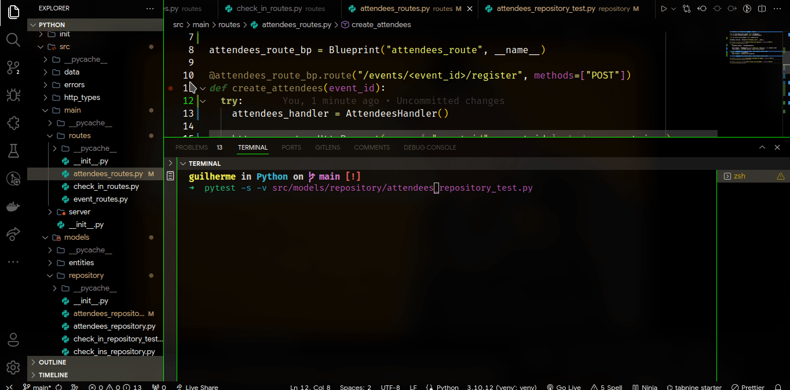

<h1 align="center">Event Manager - Python</h1>

# About the project

This is a API project in Python, which simulates an event manager, with functionalities ranging from registering for the event to viewing participant badge information.
Good unit testing and error handling practices were also implemented.

## Project presentation



# Extra technologies used

- Virtualenv: Virtual environment for python.
- Pytest: Creation of unit tests for the application.
- SQLAlchemy: Database manipulation and information, used for example to create entities.
- Flask: Elements required to implement an API and routes.
- Flask-Core: Communication with the frontend.

# How to run the project

## Database

Create a SQLite database and run the schema located in the 'init' folder.

## Tests

```bash
# Change the test file directory to test other features
pytest -s -v src/models/repository/attendees_repository_test.py
```

## Application

```bash
python3 app.py
```

# Author

Made with 💜 by Guilherme Bafica 👋

[](https://www.linkedin.com/in/guilhermebafica/)
